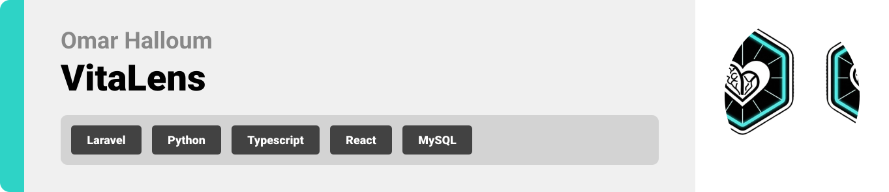

  

## License

This project is licensed under the MIT License - see the [LICENSE](LICENSE) file for details.

  

<!-- project overview -->
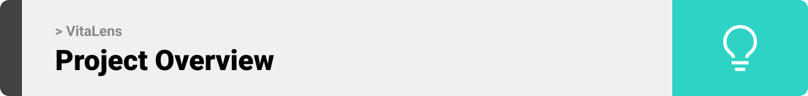

> 
> VitaLens is a comprehensive health intelligence platform designed to be the bridge between raw clinical data and meaningful understanding. The main goal of VitaLens is to automate the processing of patient medical records through smart workflows, and then leverage Machine Learning to offer risk predictions and data-driven insights.
> 

  

<!-- System Design -->
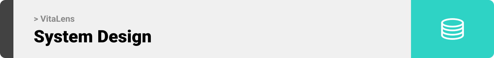

### System Design
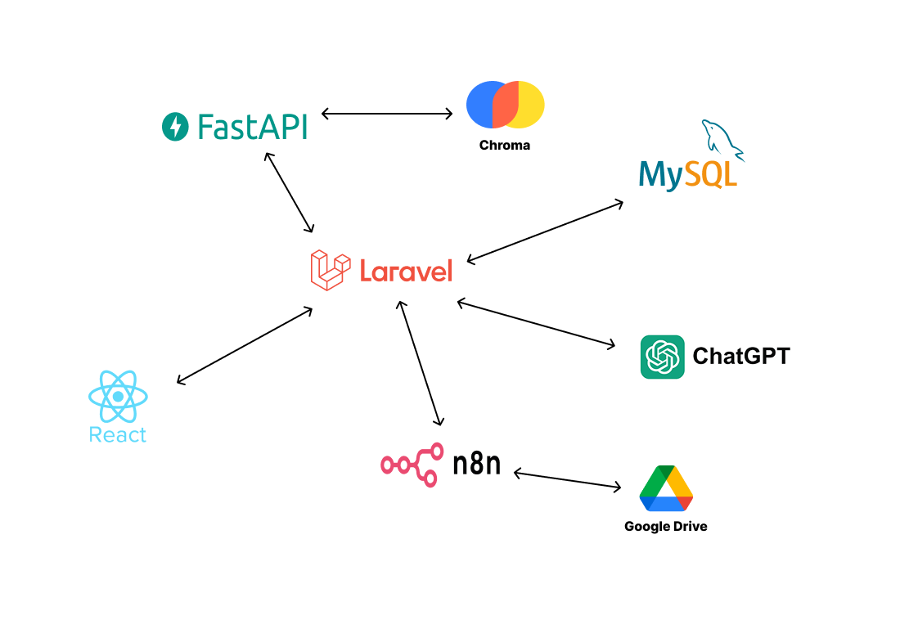

### Entity Relationship Diagram

[Eraser](https://app.eraser.io/workspace/AUjaUZ2UjylcsMpbdjEF)

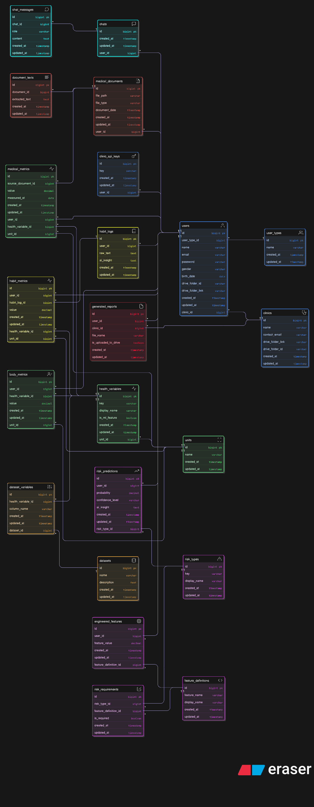

### n8n
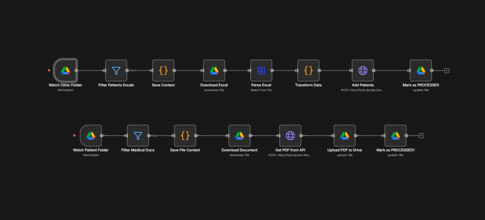

  

<!-- Project Highlights -->
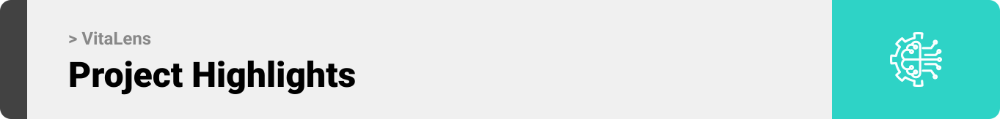

### Interesting Features

- Intelligent Medical Data Extraction: Uses OCR and NLP pipelines to automatically parse unstructured medical documents (PDFs, images) and daily habit logs, standardizing them into structured health metrics for analysis.
- Predictive Disease Risk Modeling: A custom-trained machine learning engine that processes your historical health data to forecast risk probabilities for critical conditions like Diabetes, CKD, and Cardiovascular disease.
- RAG-Powered Health Assistant: An interactive AI agent utilizing Retrieval-Augmented Generation to provide context-aware answers solely based on your personal medical history and uploaded reports.
- Automated Clinic Integration (n8n): A seamless background workflow connecting Google Drive to the platform, allowing clinics to batch-upload patient records for instant, automated risk assessment and processing.

 

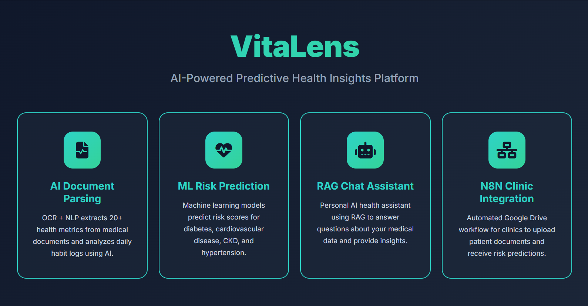

  

<!-- Demo -->
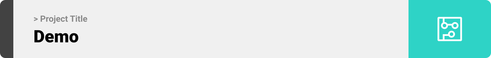

### User Screens

| Landing | Login |
| --------------------------------------- | ------------------------------------- |
|  | 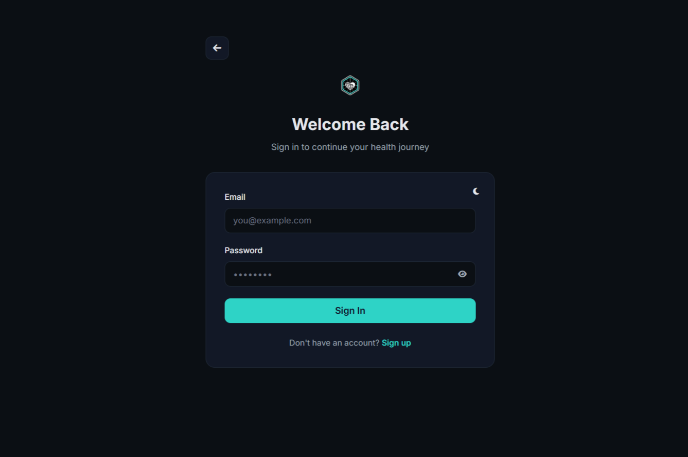 |

| Register | Dashboard (Empty) |
| --------------------------------------- | ------------------------------------- |
| 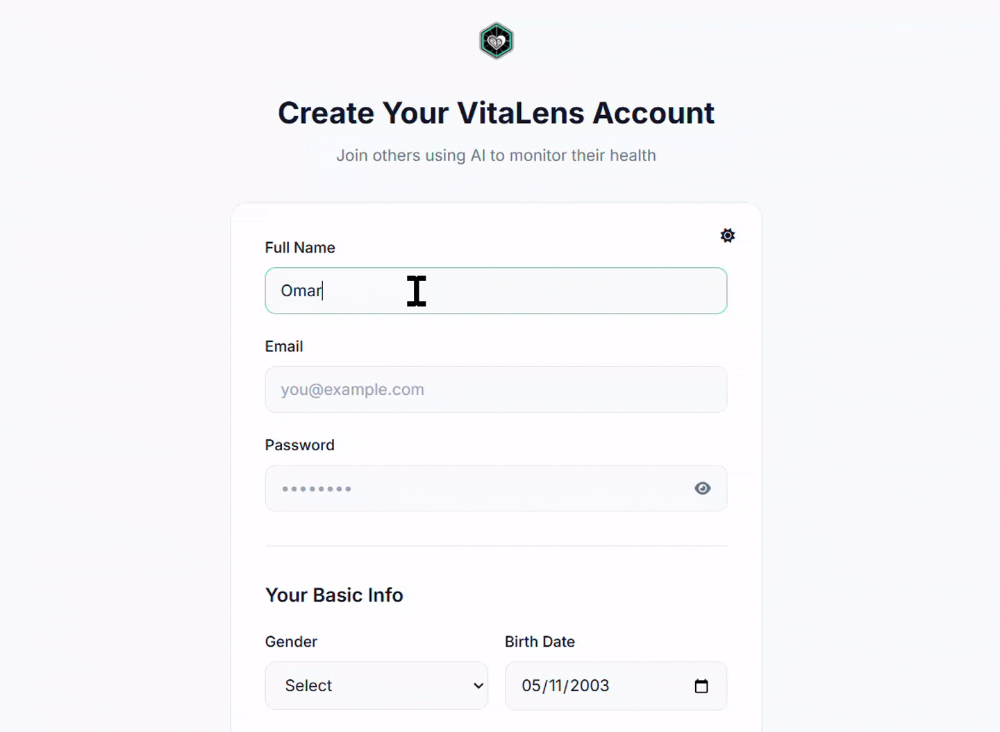 |  |

| Dashboard (Full) | Documents |
| --------------------------------------- | ------------------------------------- |
|  | 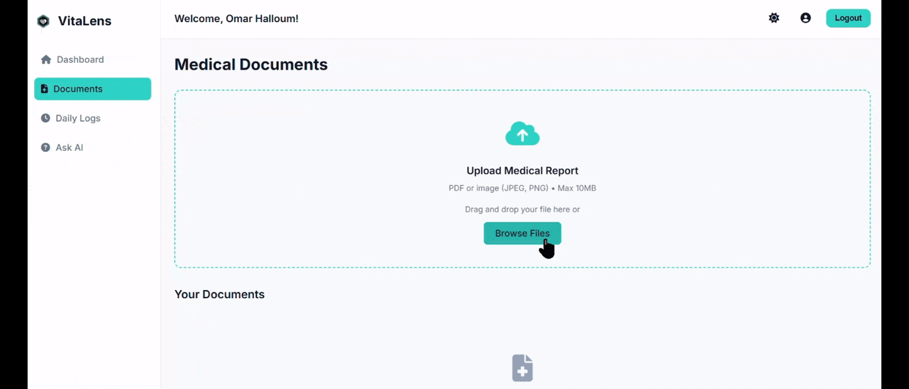 |

| Daily Logs | AI Chat |
| --------------------------------------- | ------------------------------------- |
| 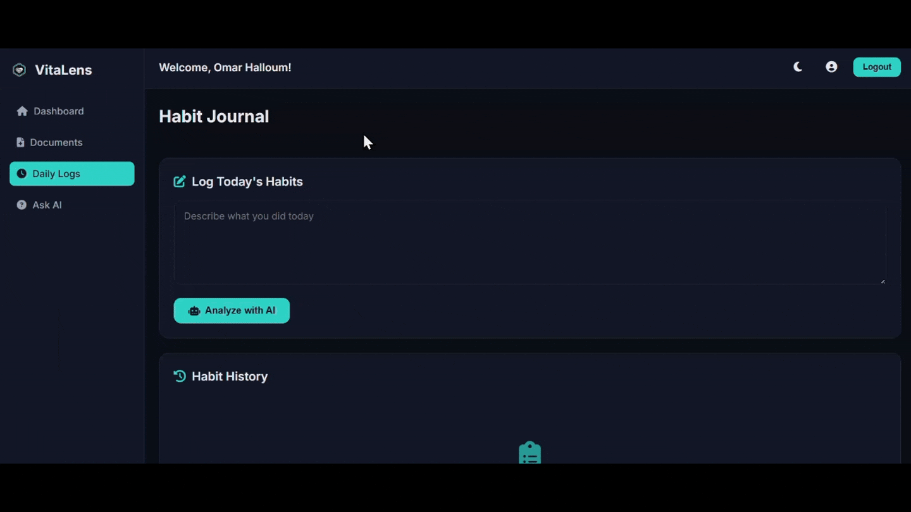 | 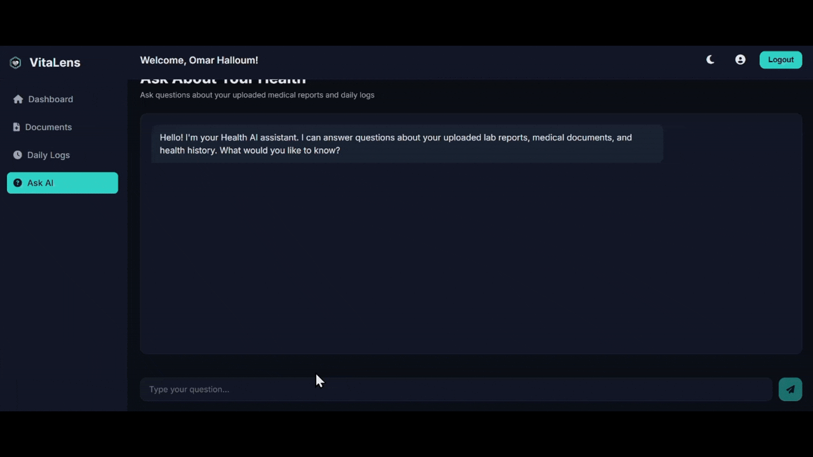 |

| Risk Details | Profile |
| --------------------------------------- | ------------------------------------- |
|  | 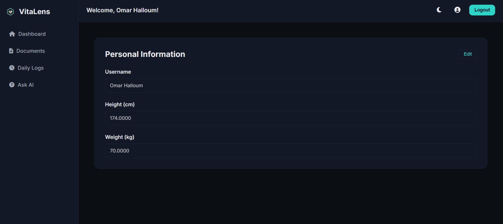 |

  

<!-- Development & Testing -->
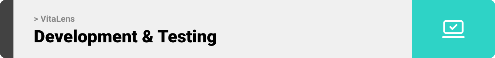

### Development Example

| Services                            | Validation                       | Testing                        |
| --------------------------------------- | ------------------------------------- | ------------------------------------- |
| 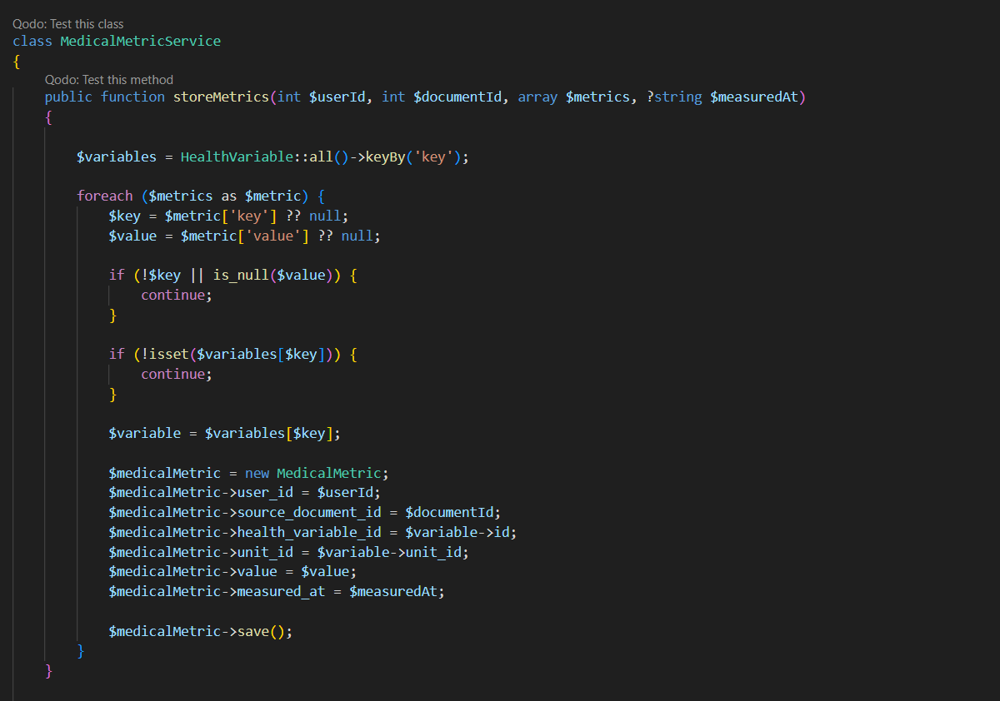 | 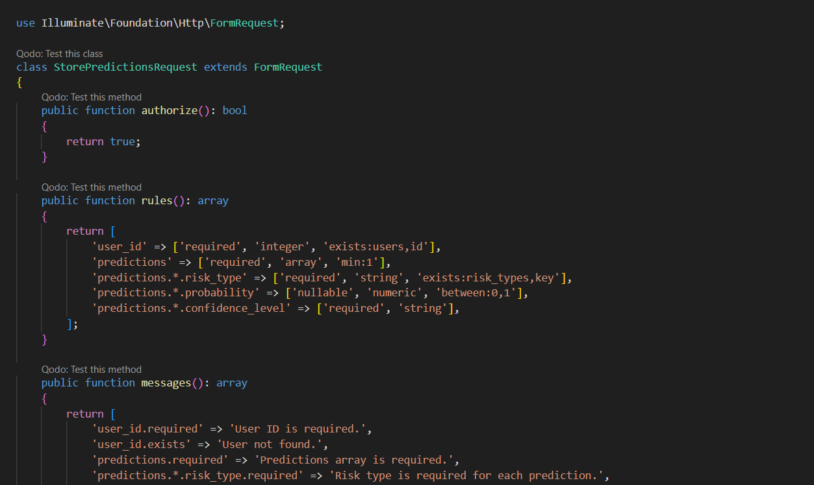 |  |

  

<!-- Deployment -->

### Add Title Here

- Description here.

| Postman API 1                            | Postman API 2                       | Postman API 3                        |
| --------------------------------------- | ------------------------------------- | ------------------------------------- |
|  |  |  |

  
